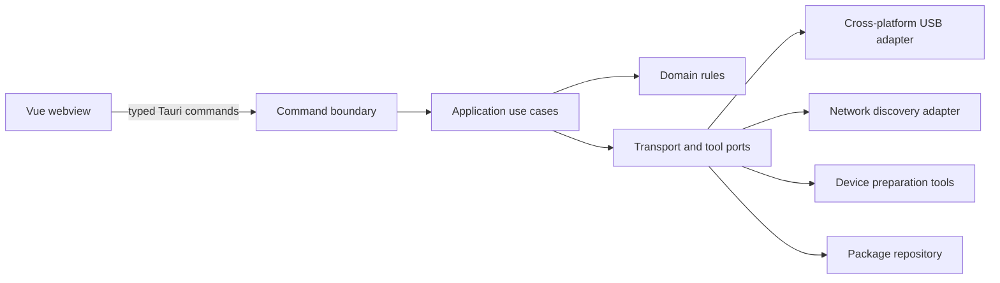
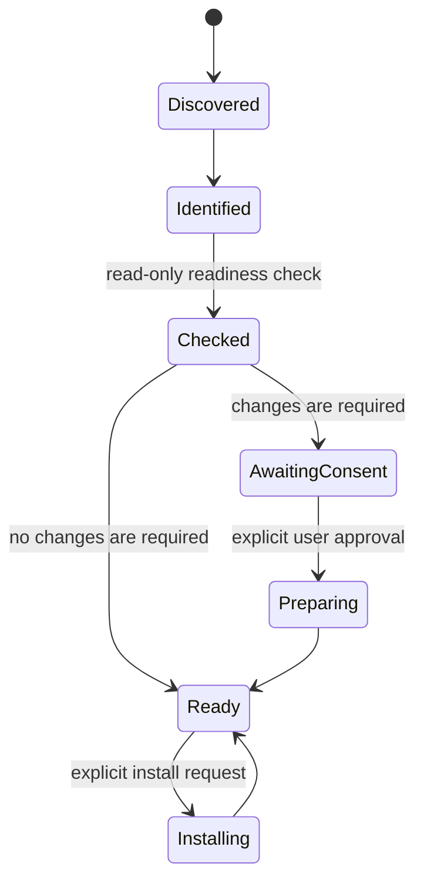

# Pocket Studio Architecture

## Boundary

Vue 只负责展示状态和收集用户意图。USB、网络、进程、文件系统、权限提升以及设备写入全部位于 Rust native 层。



具体业务落地后，`src-tauri/src` 使用以下结构：

```text
src-tauri/src/
├── commands/          # Tauri DTO 与薄命令处理器
├── application/       # 发现、准备、安装等用例
├── domain/            # 设备、工作流、应用包模型和纯规则
├── infrastructure/   # USB、网络、工具、存储实现
├── lib.rs             # Tauri composition root
└── main.rs            # anyhow 应用入口
```

当前原生接入由 `infrastructure/legacy_ios` 实现 `application::discovery::DeviceProbe`。它使用固定版本的 Legacy-iOS-Kit-rs 库，不调用外部 CLI。`DeviceDiscovery` 串行执行刷新、缓存设备事实、计算接入报告，并发送带版本的完整 `DiscoverySnapshot`；后台轮询与手动检测共享这条链路。

Tauri 命令只读取真实 inventory。未实现的准备、安装、卸载等操作返回稳定错误 `operationUnavailable`；`Studio` 不连接模拟工作流驱动。浏览器单独使用 `simulatedGateway.ts`，保留完整交互演示。界面通过 gateway capabilities 显示实际可用功能。

型号、版本、电量、容量及受保护标识均可以为空。越狱、SSH、配对事实采用 `Option<bool>`，未确认与检测失败分开表示。Ready 必须同时满足支持的型号与系统、正常模式、有效配对、已验证越狱和 SSH。未知信息得到 `needsAttention`，不会自动产生越狱方案。

设备事件一次性携带设备和接入报告，前端按 revision 丢弃过期结果。事件订阅完成后才请求初始 inventory。发现失败或超时会清除之前的 readiness；断开不保留旧连接句柄。设备列表支持显式选择，不因另一台设备接入而覆盖当前选择。

原生操作日志的 ID 在进程会话内唯一；webview 保存最近 2,000 条，并将真实设备日志与浏览器模拟日志分开存储。导出提供文本预览与复制，浏览器另外触发文件下载。

## Device lifecycle



- `Discovered`、`Identified` 和 readiness check 必须是只读操作。
- root、越狱、解锁、刷写、擦除和安装必须分别展示影响并获取明确授权。
- 操作应当可取消；无法安全取消的步骤必须在开始前说明。
- 设备断开后，不复用旧连接句柄或未经重新验证的状态。

## Cross-platform design

优先选择同时支持 macOS、Linux 和 Windows 的 Rust crate。不可避免的平台实现放在同一个 port 后方，并为三个平台提供行为定义：

| Capability        | macOS                      | Linux                                    | Windows                            |
| ----------------- | -------------------------- | ---------------------------------------- | ---------------------------------- |
| USB discovery     | nusb + system usbmuxd      | nusb + usbmuxd; USB permissions required | nusb + Apple Mobile Device Service |
| Network discovery | shared socket/mDNS adapter | shared socket/mDNS adapter               | shared socket/mDNS adapter         |
| External tools    | platform process adapter   | platform process adapter                 | platform process adapter           |
| Privilege request | explicit OS flow           | explicit policy/helper flow              | explicit elevation flow            |

平台差异由 `legacy_ios/platform/{macos,linux,windows}.rs` 中的 HostEnvironment 策略定义，正常模式均使用 System backend。系统服务不可用时返回对应的诊断码，不隐式改用 Direct backend 或抢占 USB 接口。平台差异不得进入领域模型、应用用例或 Vue 组件。

### Window chrome

窗口边框与标题栏由 Tauri 的原生窗口管理，`decorations: true`；macOS 使用 `titleBarStyle: Visible`。
Vue 顶部区域只是一条应用工具栏，不绘制红绿灯、最小化、最大化或关闭按钮。
原生标题栏显示应用名；Vue 工具栏合并历史导航、四个页面图标、任务 LCD、设备选择与搜索。浏览器预览也使用同一条工具栏，不模拟窗口按钮。

页面历史由 `src/app/useStudioNavigation.ts` 管理，只记录页面、设备子页与应用 ID。前进 / 后退不调用设备操作或重放同意记录；准备流程与模态期间统一锁定导航。

| 平台    | 窗口控制行为                                                    |
| ------- | --------------------------------------------------------------- |
| macOS   | 原生红绿灯及系统缩放、全屏、拖动行为                            |
| Windows | 原生标题栏的最小化、最大化 / 还原、关闭与系统窗口行为           |
| Linux   | 由 Tauri/GTK 与桌面环境提供窗口装饰，按钮位置与行为遵循桌面配置 |

不通过 user-agent 判断系统，不在 WebView 内模拟另一个系统的按钮布局。

## Error and observability policy

- domain、application 和 infrastructure 库错误使用 `thiserror`。
- `main.rs` 和 composition root 使用 `anyhow` 添加启动上下文。
- Tauri command 将内部错误转换为稳定的错误码，不能直接把调试字符串作为 API。
- `tracing` 等级遵循 `AGENTS.md`；协议 trace 不记录凭据、配对资料、私钥、设备内容或完整敏感标识符。

## Marketplace boundary

应用市场数据和设备安装器是两个独立 port：catalog 只提供经过验证的 manifest，installer 只接收已解析且与设备兼容的 artifact。manifest 至少需要包含包 ID、版本、支持的平台/型号、下载摘要、签名信息和安装策略。

下载、校验、设备写入分别记录状态。任何校验失败都必须在设备写入前终止。

## Legacy device sessions

已有配对的会话建立和关闭由 Legacy-iOS-Kit-rs 的 `legacy-tls` 功能负责，Studio 通过 `NormalDevice::inspect()` 获取检测结果。依据 libimobiledevice，iOS < 7 调用 ValidatePair；iOS < 10 的 USB 会话使用 TLS 1.0，较新版本最低使用 TLS 1.2。TLS 客户端使用配对根身份，服务器证书固定为配对记录中的设备证书。兼容密码套件不会用于 HTTP 连接或主机全局 TLS 设置。

正常检测不创建配对记录、不登录 SSH、不写设备。AFC2 访问或 Cydia 的 SpringBoard 注册信息与 SSH 响应共同作为越狱证据。未找到证据保持 unknown，不能据此推断为未越狱。依赖库会打印协议数据的日志层始终被过滤，RUST_LOG 不能开启配对材料输出。

技术依据、边界测试与真机验证见 [legacy-ios-compatibility.md](legacy-ios-compatibility.md)。开发阶段标记、后端类型及“只读接入”等实现信息保留在工程文档，不进入产品页面。
