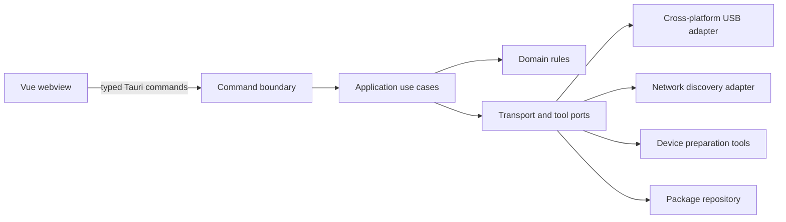
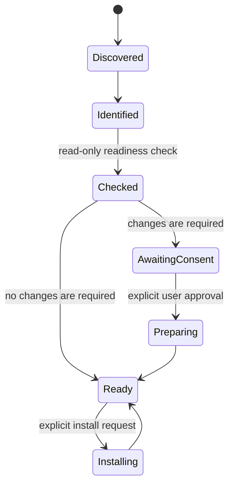

# Pocket Studio Architecture

## Boundary

Vue 只负责展示状态和收集用户意图。USB、网络、进程、文件系统、权限提升以及设备写入全部位于 Rust native 层。



具体业务落地后，`src-tauri/src` 使用以下结构：

```text
src-tauri/src/
├── commands/          # Tauri DTO 与薄命令处理器
├── application/       # 发现、准备、安装等用例
├── domain/            # 设备、工作流、应用包模型和纯规则
├── infrastructure/   # USB、网络、工具、存储实现
├── lib.rs             # Tauri composition root
└── main.rs            # anyhow 应用入口
```

在有第一个真实实现前不创建这些模块，避免用占位抽象固定未经验证的协议设计。

## Device lifecycle



- `Discovered`、`Identified` 和 readiness check 必须是只读操作。
- root、越狱、解锁、刷写、擦除和安装必须分别展示影响并获取明确授权。
- 操作应当可取消；无法安全取消的步骤必须在开始前说明。
- 设备断开后，不复用旧连接句柄或未经重新验证的状态。

## Cross-platform design

优先选择同时支持 macOS、Linux 和 Windows 的 Rust crate。不可避免的平台实现放在同一个 port 后方，并为三个平台提供行为定义：

| Capability        | macOS                                  | Linux                                 | Windows                                 |
| ----------------- | -------------------------------------- | ------------------------------------- | --------------------------------------- |
| USB discovery     | shared adapter or IOKit implementation | shared adapter or udev implementation | shared adapter or WinUSB implementation |
| Network discovery | shared socket/mDNS adapter             | shared socket/mDNS adapter            | shared socket/mDNS adapter              |
| External tools    | platform process adapter               | platform process adapter              | platform process adapter                |
| Privilege request | explicit OS flow                       | explicit policy/helper flow           | explicit elevation flow                 |

平台差异不得进入领域模型、应用用例或 Vue 组件。

## Error and observability policy

- domain、application 和 infrastructure 库错误使用 `thiserror`。
- `main.rs` 和 composition root 使用 `anyhow` 添加启动上下文。
- Tauri command 将内部错误转换为稳定的错误码，不能直接把调试字符串作为 API。
- `tracing` 等级遵循 `AGENTS.md`；协议 trace 不记录凭据、配对资料、私钥、设备内容或完整敏感标识符。

## Marketplace boundary

应用市场数据和设备安装器是两个独立 port：catalog 只提供经过验证的 manifest，installer 只接收已解析且与设备兼容的 artifact。manifest 至少需要包含包 ID、版本、支持的平台/型号、下载摘要、签名信息和安装策略。

下载、校验、设备写入分别记录状态。任何校验失败都必须在设备写入前终止。
