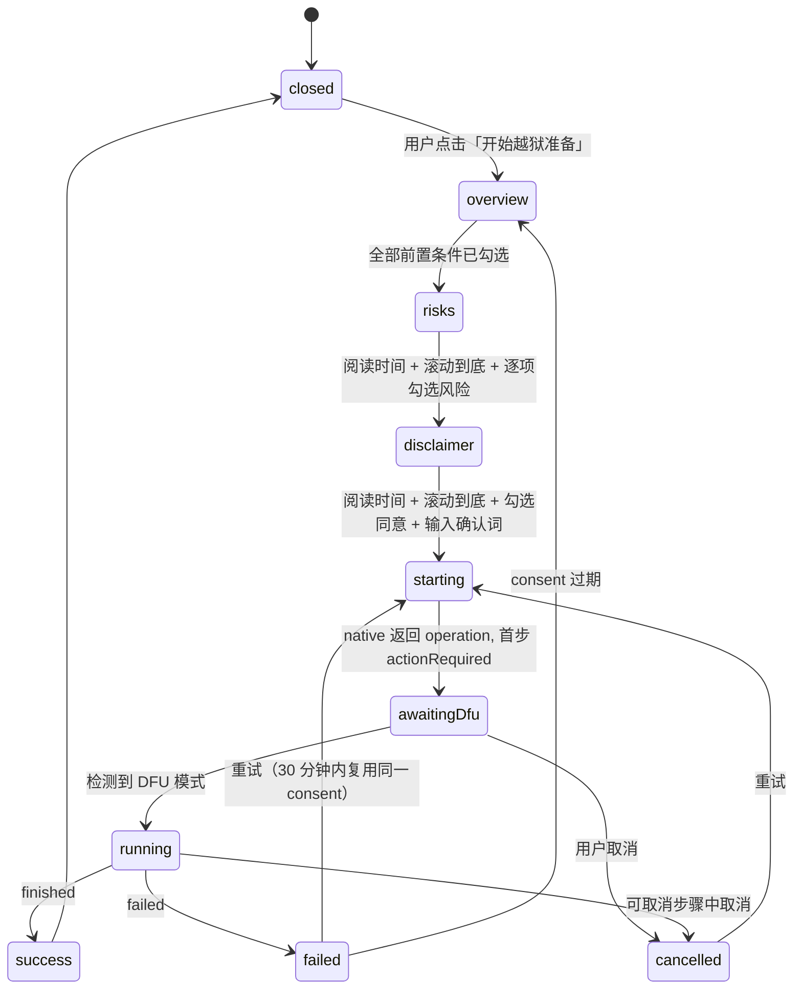

# Device preparation flow (iPod touch 4 demo)

本文描述当前 demo 中「设备准备」与「应用安装」的交互设计。所有设备操作均为模拟，
native 层只提供 `DemoDriver`，不会触碰任何真实硬件。真实实现将基于
[Legacy-iOS-Kit-rs](https://github.com/HalfSweet/Legacy-iOS-Kit-rs) 的
`Request → Plan → explicit destructive consent → Execute → event stream` 模型。

## 参考流程

iPod touch (4th generation, `iPod4,1`, A4) 运行 iOS 6.1.6，使用 Legacy iOS Kit 的
"Jailbreak Device"（ramdisk 方式）：

1. 进入 DFU 模式（同时按住电源键与 Home 键 8 秒，松开电源键，继续按住 Home 键 8 秒）。
2. limera1n 利用 bootrom 漏洞进入 pwned DFU。
3. 下载 iOS 6.1.6 固件组件与越狱载荷，构建带 SSH 的 ramdisk。
4. 启动 ramdisk、挂载文件系统、写入 untether 与 Cydia。
5. 重启并验证。

特性：不清除数据、完美越狱、需要按键正常、建议先备份并保存 SHSH。

## 状态机

## 同意记录（ConsentRecord）

同意必须绑定到具体的 `PreparationPlan`：

- `planId` 必须与方案一致；
- 每个前置条件、每个风险项都必须单独确认；
- `disclaimerVersion` 必须等于方案中的版本；
- 阅读时长必须不低于方案要求的最小值。

规则位于 `src-tauri/src/domain/preparation.rs` 的 `validate_consent`，有单元测试覆盖。
前端无法绕过：`start_preparation` 是进入任何会修改设备的流程的唯一入口。

## 步骤属性

| 属性               | 含义                                                         |
| ------------------ | ------------------------------------------------------------ |
| `cancellable`      | 该步骤运行中允许取消；否则取消请求被拒绝（`notCancellable`） |
| `pointOfNoReturn`  | 从该步骤开始写入设备，中断可能需要完整恢复                   |
| `requiresAction`   | 需要用户物理操作（目前只有 `enterDfu`）                      |
| `estimatedSeconds` | 用于总进度条权重与耗时估计                                   |

## 错误与恢复

每个失败都带有 `OperationError { code, recoverable, retryFromStepId }`。
UI 依据 `code` 显示标题、说明与恢复步骤列表（locale 中的 `preparation.errors.*`），
`recoverable=false` 时不提供重试按钮，只提供恢复指引。

## 事件流

native 通过三个事件通道向 webview 推送：

- `studio://device`：attached / detached / modeChanged / updated
- `studio://operation`：started / stepChanged / progress / actionRequired / actionResolved / finished / failed / cancelled
- `studio://log`：每条日志

浏览器模式（`pnpm dev`）下由 `src/shared/gateway/simulatedGateway.ts` 生成完全相同的事件。

## 演示控制

侧边栏「演示控制」提供：接入/拔出设备、进入/退出 DFU、标记越狱状态、为某个步骤注入失败。
它们对应真实世界中的物理动作，用于走通所有 UI 分支（断连、失败、不可取消等）。
