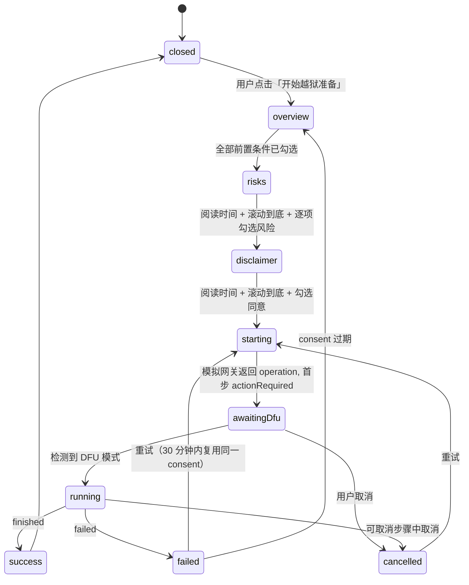

# Device preparation flow (iPod touch 4 demo)

> 本文保留浏览器模拟模式的交互设计。当前 Tauri 桌面端已接入 iPod4,1 / iOS 6.1.6 的原生准备执行链；顺序、一次性授权、取消边界和验证范围见 [原生设备准备](native-preparation.md)。

浏览器使用模拟网关，原生设备操作只在 Rust 中执行。应用安装目前仍仅有浏览器演示。

## 参考流程

iPod touch (4th generation, `iPod4,1`, A4) 运行 iOS 6.1.6，使用 Legacy iOS Kit 的
"Jailbreak Device"（ramdisk 方式）：

1. 进入 DFU 模式（正常模式同时按住电源键与 Home 键 10 秒（恢复模式 8 秒），松开电源键，继续按住 Home 键 8 秒）。
2. limera1n 利用 bootrom 漏洞进入 pwned DFU。
3. 下载 iOS 6.1.6 固件组件与越狱载荷，构建带 SSH 的 ramdisk。
4. 启动 ramdisk、挂载文件系统、写入 untether 与 Cydia。
5. 重启并验证。

上游描述该方式不以擦除为目标，使用 untether；但恢复故障可能清除数据，不能承诺无损。需要按键正常，建议先备份并保存 SHSH。Rust 工具链尚不提供 DFU IPSW。

## 状态机

## 同意记录（ConsentRecord）

同意必须绑定到具体的 `PreparationPlan`：

- `planId` 必须与方案一致；
- 每个前置条件、每个风险项都必须单独确认；
- `disclaimerVersion` 必须等于方案中的版本；
- 阅读时长必须不低于方案要求的最小值。

当前演示在 `src/shared/gateway/consent.ts` 校验两阶段确认与时长、顺序、有效期；关键边界由 `pnpm test` 覆盖。
这仅保护演示状态流转。真实接入时必须继续由 native 层的领域规则校验，不应把前端计时当作可信安全边界。

## 步骤属性

| 属性               | 含义                                                         |
| ------------------ | ------------------------------------------------------------ |
| `cancellable`      | 该步骤运行中允许取消；否则取消请求被拒绝（`notCancellable`） |
| `pointOfNoReturn`  | 从该步骤开始写入设备，中断可能需要完整恢复                   |
| `requiresAction`   | 需要用户物理操作（目前只有 `enterDfu`）                      |
| `estimatedSeconds` | 用于总进度条权重与耗时估计                                   |

## 错误与恢复

每个失败都带有 `OperationError { code, recoverable, retryFromStepId }`。
UI 依据 `code` 显示标题、说明与恢复步骤列表（locale 中的 `preparation.errors.*`），
`recoverable=false` 时不提供重试按钮，只提供恢复指引。

## 事件流

native 通过三个事件通道向 webview 推送：

- `studio://device`：attached / detached / modeChanged / updated
- `studio://operation`：started / stepChanged / progress / actionRequired / actionResolved / finished / failed / cancelled
- `studio://log`：每条日志

浏览器模式（`pnpm dev`）下由 `src/shared/gateway/simulatedGateway.ts` 生成完全相同的事件。

## 演示控制

底部「演示控制」提供：接入/拔出设备、进入/退出 DFU、标记越狱状态、为某个步骤注入失败。
它们对应真实世界中的物理动作，用于走通所有 UI 分支（断连、失败、不可取消等）。

## 布局对应

以 `.design/Pocket Studio 设计规划/Pocket Studio.dc.html` 与 `Pocket Studio Wireframes.dc.html` 为准。
风险与免责对应 5f/5g 两步模态；前置检查、DFU、执行与结果嵌入前置环境页，对应 5h。
应用商店为两行七列（5c），详情含四个示意预览和右侧信息栏（5d），日志支持筛选、展开和导出（5i）。

## 上游依据

- [Ramdisk 越狱说明](https://github.com/LukeZGD/Legacy-iOS-Kit/wiki/Jailbreaking-with-Legacy-iOS-Kit)
- [DFU 时序：restore.sh 的 device_dfuhelper](https://github.com/LukeZGD/Legacy-iOS-Kit/blob/main/restore.sh)
- [Rust 工具链与硬件验证限制](https://github.com/HalfSweet/Legacy-iOS-Kit-rs)

只读取以上文档与源代码用于设计，没有运行上游脚本或操作真实设备。
